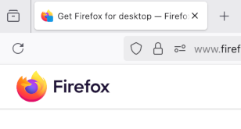
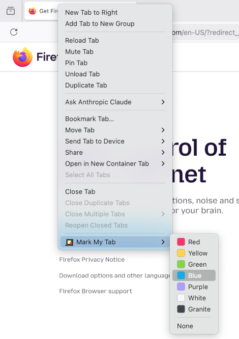

# Mark My Tab

A small Firefox extension for marking tabs which you want to revisit in a near future. A colored badge is added to tab's favicon. 7 carefully selected colors are available. 

# Using

After installation, a new tab context menu item "Mark My Tab" is available. Choose the color you want. To remove the badge, select "None".

## Running Locally

Taken from [MDN](https://developer.mozilla.org/en-US/docs/Mozilla/Add-ons/WebExtensions/Your_first_WebExtension#trying_it_out):

Open the `about:debugging` page, click the `This Firefox` option, click the `Load Temporary Add-on` button, then select any file in your extension's directory.

The extension now installs, and remains installed until you restart Firefox.

Alternatively, you can run the extension from the command line using the web-ext tool.
